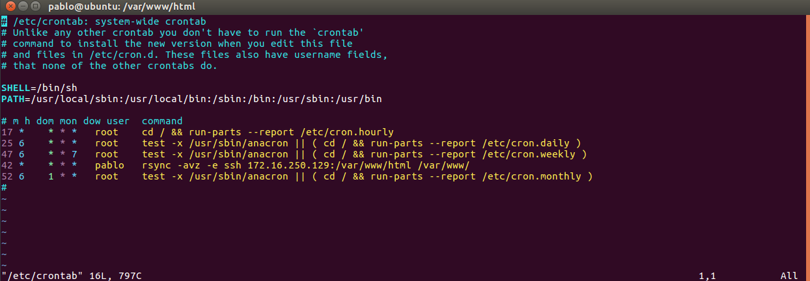

## PRÁCTICA 2 DE LA ASIGNATURA SWAP

Miro la IP de mis dos máquinas:

Hago tar por ssh desde una máquina hasta la otra y compruebo que lo he creado correctamente:

Instalamos rsync en las dos máquinas con el comando:

- sudo apt-get install rsync

Ahora hacemos dueño a nuestro usuario de la carpeta donde se almacena el contenido web con el comando:

- sudo chown pablo:pablo –R /var/www

Ahora clonamos el contenido de la carpeta del servidor web de una máquina a otra:

Lo comprobamos con el comando:

- ls -la /var/www

Generamos la clave:

Hacemos copia de la clave y probamos a acceder sin contraseña:

Accedemos al archivo /etc/crontab para programar alguna tarea con el comando:

- sudo vim /etc/crontab

Nos quedaría tal que asi:

Lo he configurado para que se ejecute a los 42 minutos de cada hora, todas las horas del dia, todos los dias de la semana y del mes, todos los meses.

