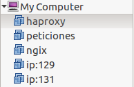
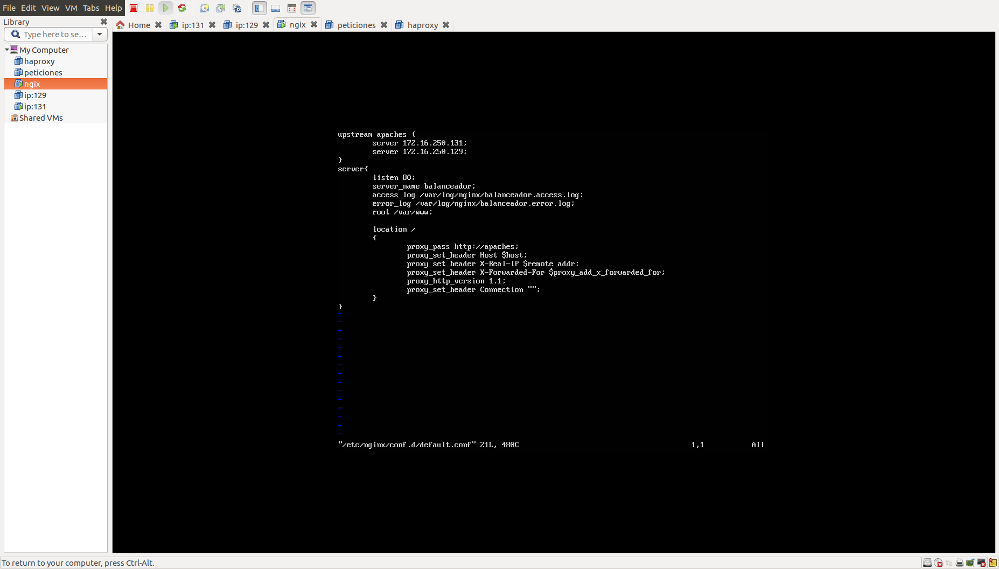
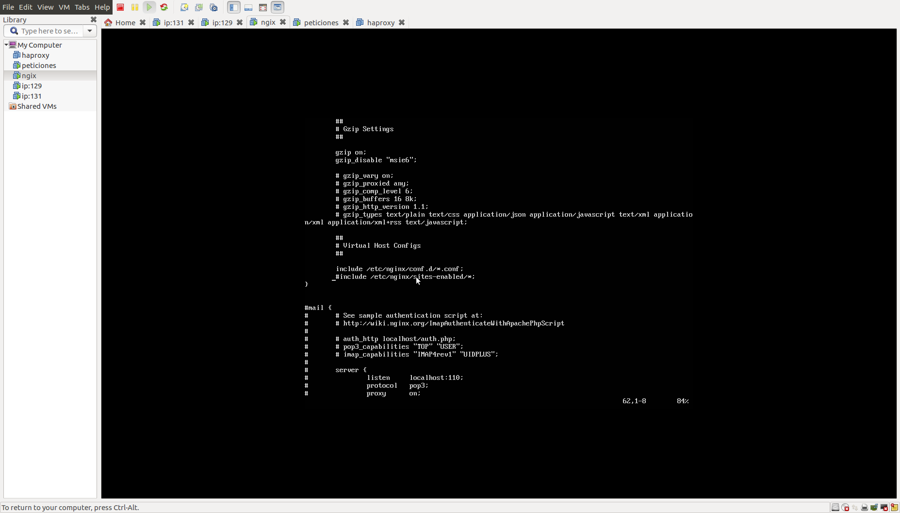
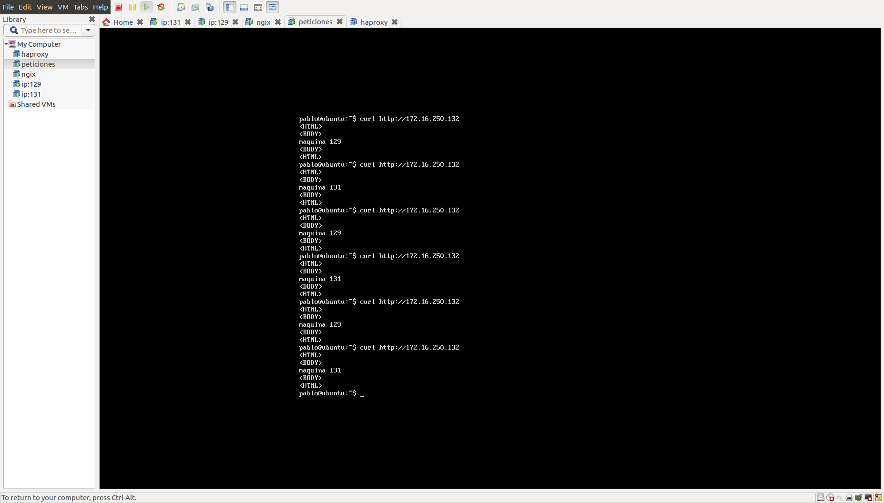
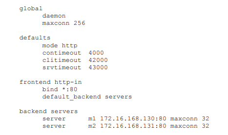
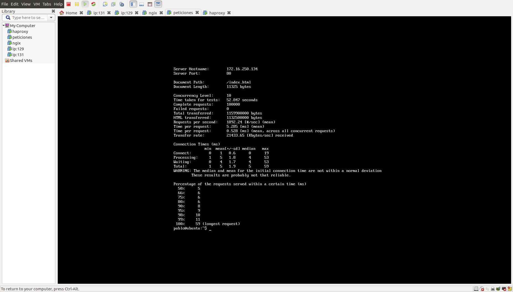
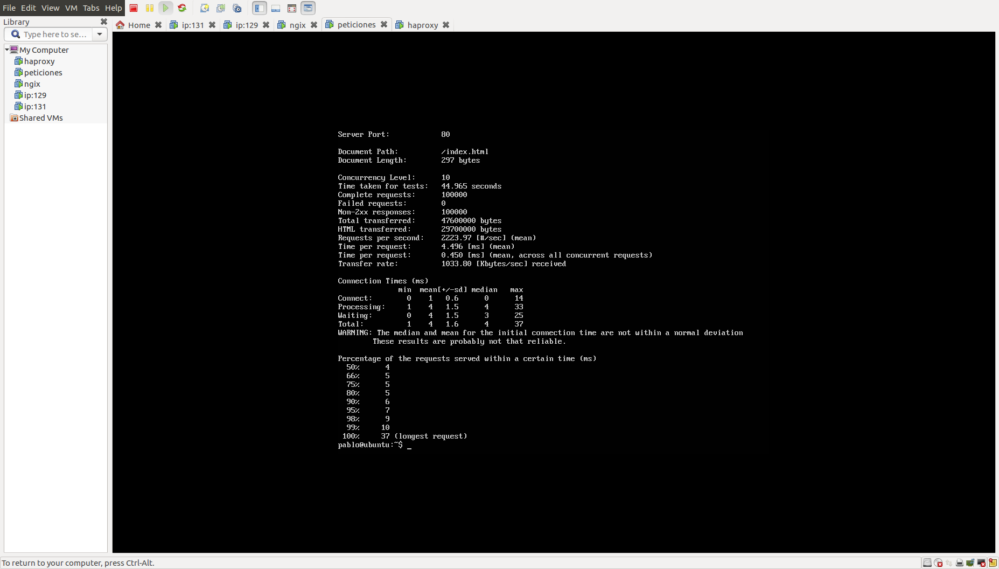

## PRÁCTICA 3 DE LA ASIGNATURA SWAP

## Primero configuramos configuramos nginx

Vamos a crear 3 máquinas nuevas, 2 para los 2 balanceadores que tenemos que configurar, y otra para hacer peticiones:

Instalamos nginx con los siguientes comandos:

- sudo apt-get update && sudo apt-get dist-upgrade && sudo apt-get autoremove
- sudo apt-get install nginx
- sudo systemctl start nginx

Creamos el archivo de configuración de nginx:

- touch /etc/nginx/conf.d/default.conf

Y lo configuramos tal que así:

Para terminar la configuración de nginx comentamos la siguiente linea(linea "#include /etc/nginx/sites-enabled/") del fichero /etc/nginx/nginx.conf que es la que indica que actúe como balanceador web:

Con esta configuración, ya podemos probar a hacer curl desde nuestra máquina de peticiones, y comprobamos que funciona:

## Segundo configuramos Haproxy

Instalamos Haproxy con el comando:

- sudo apt-get install haproxy

Modificamos el fichero /etc/haproxy/haproxy.cfg, añadiendo lo que falte y modificando lo que haya que modificar:

Lanzamos el servicio con el comando:

- sudo /usr/sbin/haproxy -f /etc/haproxy/haproxy.cfg

Ya funciona, podemos comprobarlo con un curl desde la máquina que hace peticiones.

## Someter a una alta carga el servidor balanceado

Vamos a ver primero para Haproxy:

- ab -n 100000 -c 10 http://172.16.250.134/index.html

Ahora para nginx:

- ab -n 100000 -c 10 http://172.16.250.132/index.html

Vemos que claramente nginx es más rápido, se aprecia en el tiempo por request y en el requests per second.
