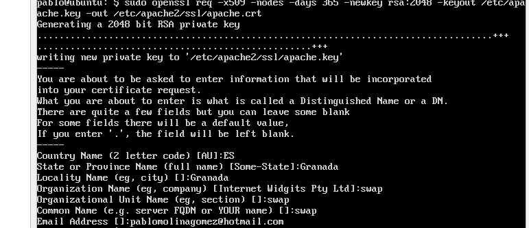
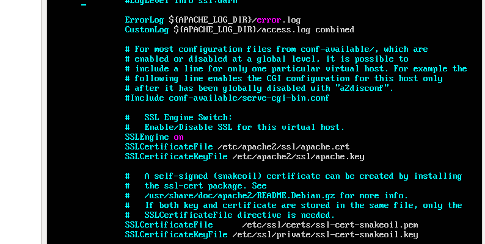
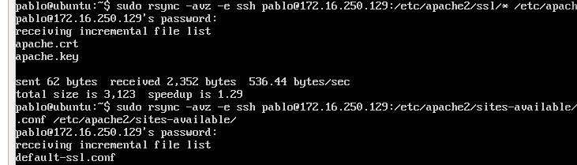
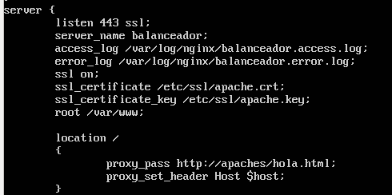
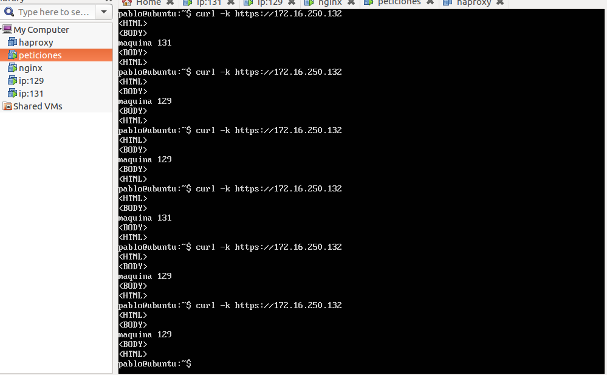
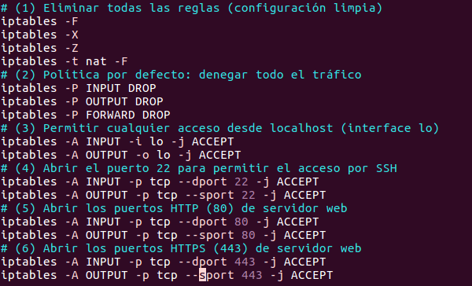
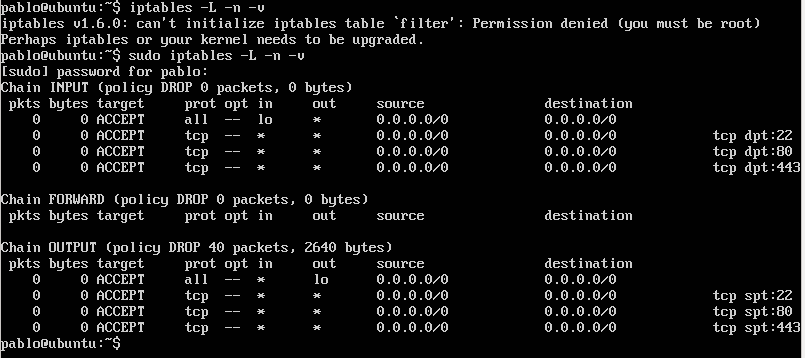

## PRÁCTICA 4 DE LA ASIGNATURA SWAP

## Primero generamos e instalamos un certificado autoinstalado

Debemos activar el módulo SSL de Apache, generar los certificados y especificarle la ruta a los
certificados en la configuración. Así pues, como root ejecutaremos:
- a2enmod ssl
- service apache2 restart
- mkdir /etc/apache2/ssl
- openssl req -x509 -nodes -days 365 -newkey rsa:2048 -keyout /etc/apache2/ssl/apache.key -out /etc/apache2/ssl/apache.crt

Configuramos con los siguientes datos:

Editamos el archivo de configuración del sitio:

- nano /etc/apache2/sites-available/default-ssl.conf

Y le añadimos estas lineas debajo de SSLEngine on:

SSLCertificateFile /etc/apache2/ssl/apache.crt
SSLCertificateKeyFile /etc/apache2/ssl/apache.key

Y queda tal que así:

Activamos el sitio default- ssl y reiniciamos apache:
- a2ensite default-ssl
- service apache2 reload

Comprobamos que funciona haciendo:

- curl –k https://172.16.250.129/index.html

Ahora vamos a hacerlo en la otra máquina, para esto, nos posicionamos en la máquina que no está configurada y sincronizamos la máquina ya configurada y las claves en la otra máquina con los comandos:

- rsync -avz -e ssh pablo@172.16.250.129:/etc/apache2/ssl/* /etc/apache2/ssl/

- rsync -avz -e ssh pablo@172.16.250.129:/etc/apache2/sites-available/default-ssl.conf /etc/apache2/sites-available/

Aquí se ve como se sincroniza:

Seguimos los pasos que seguimos para activar el módulo SSL de Apache, generar los certificados y especificarle la ruta a los certificados que hicimos con la primera máquina y ya estaría configurada del todo.

Solo falta configurarlo en nginx.

Sincronizamos con:

- rsync -avz -e ssh pablo@172.16.250.129:/etc/apache2/ssl/* /etc/ssl/

Y añadimos lo siguiente a el fichero /etc/nginx/conf.d/default.config

Y comprobamos que funciona desde nuestra máquina de peticiones:

## Configuración iptables

creamos un script con:

- touch iptablesconfig.sh

Le añadimos:

Para que arranque al inicio, lo copiamos a la carpeta /etc/init.d. Nos situamos en esa carpeta y le damos permisos de ejecución:

- chmod +x iptablesconfig.sh

Ya sólo hace falta decirle al sistema que lea y ejecute el script que hemos insertado en la carpeta, para ello ejecutamos el comando:

- update-rc.d iptablesconfig.sh defaults 80

Ahora comprobamos que al reiniciar el sistema se ejecuta nuestro script:

