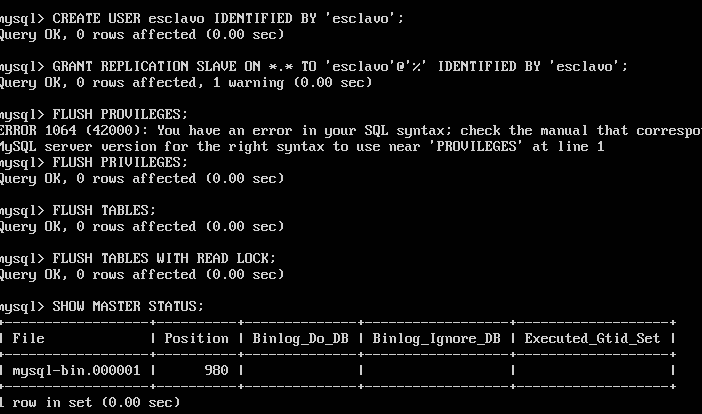

## PRÁCTICA 5 DE LA ASIGNATURA SWAP

## Crear una base de datos
La creamos e insertamos datos con los siguientes comandos:

- mysql -uroot -p (accedemos)
- create database contactos;
- use contactos;
- create table datos(nombre varchar(100),tlf int);
- insert into datos(nombre,tlf) values ("pepe",95834987);

## Replicar BD MySQL

Se puede hacer con el comando:

- mysqldump contactos -u root -p > /tmp/contactos.sql

Esto puede ser suficiente, pero tenemos que tener en cuenta que los datos pueden estar actualizándose constantemente en el servidor de BD principal. En este caso, antes de hacer la copia de seguridad en el archivo .SQL debemos evitar que se acceda a la BD para cambiar nada.

Así que podemos hacer:

- mysql -u root –p
- FLUSH TABLES WITH READ LOCK;
- quit

Y ahora si ejecutamos el comando mysqldump.

Ahora desbloqueamos las tablas que habíamos bloqeuado antes:

- mysql -u root –p
- UNLOCK TABLES;
- quit

Ahora vamos a la otra maquina y ejecutamos el comando:

- scp 172.16.250.135:/tmp/contantos.sql /tmp/

y queda tal que así:

SQL de copia de seguridad tiene formato de
texto plano, e incluye las sentencias SQL para restaurar los datos contenidos en la BD
en otra máquina. Sin embargo, la orden mysqldump no incluye en ese archivo la
sentencia para crear la BD (es necesario que nosotros la creemos en la máquina
secundaria en un primer paso, antes de restaurar las tablas de esa BD y los datos
contenidos en éstas).

Así que creamos la base de datos aquí también:

- mysql -u root -p
- CREATE DATABASE contactos;
- quit

Y ahora restauramos los datos contenidos en la BD:
- mysql -u root -p contactos < /tmp/contactos.sql

## Replicación de BD mediante configuración maestro-esclavo

La opción anterior funciona perfectamente, pero es algo que realiza un operador a
mano. Sin embargo, MySQL tiene la opción de configurar el demonio para hacer
replicación de las BD sobre un esclavo a partir de los datos que almacena el maestro.

Vamos al archivo de configuración /etc/mysql/mysql.conf.d/mysqld.cnf:

- sudo nano /etc/mysql/mysql.conf.d/mysqld.cnf

Y alli efectuamos los siguientes cambios:

Comentamos el parámetro bind-address que sirve para que escuche a un servidor:

- #bind-address 127.0.0.1

Le indicamos el archivo donde almacenar el log de errores. De esta forma, si por
ejemplo al reiniciar el servicio cometemos algún error en el archivo de configuración,
en el archivo de log nos mostrará con detalle lo sucedido:

- log_error = /var/log/mysql/error.log

Establecemos el identificador del servidor.

- server-id = 1

El registro binario contiene toda la información que está disponible en el registro de
actualizaciones, en un formato más eficiente y de una manera que es segura para las
transacciones:

- log_bin = /var/log/mysql/bin.log

Guardamos el documento y reiniciamos el servicio:

- sudo /etc/init.d/mysql restart

Ahora pasamos al esclavo. Hacemos exactamente lo mismo pero cambiando el server-id = 1 por server-id = 2.

Entramos en mysql y hacemos:

Y ya está todo listo para que los demonios de
MySQL de las dos máquinas repliquen automáticamente los datos que se
introduzcan/modifiquen/borren en el servidor maestro.

Para comprobar que todo está bien, nos vamos al esclavo y hacemos(dentro de mysql):

- SHOW UNLOCK STATUS\G

Y vemos que el valor de la variable Second_Behind_Master es distinto de "null", por lo que todo funciona correctamente:

También lo comprobamos haciendo un cambio en el maestro:

Y vemos que se actualiza automaticamente en el esclavo:

